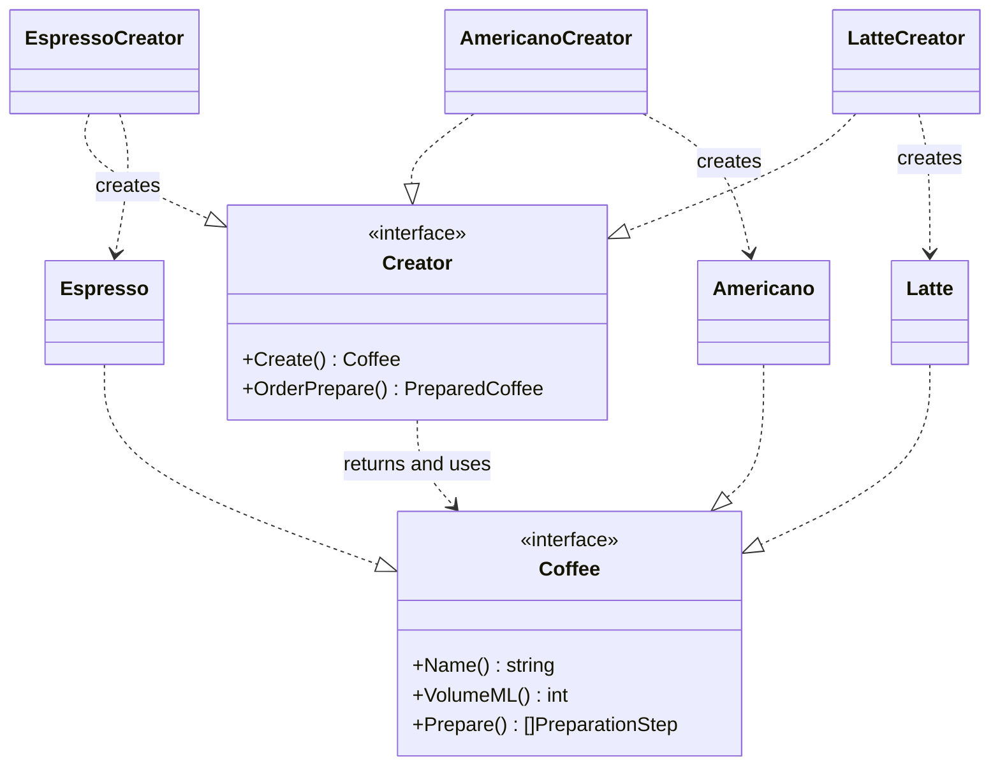
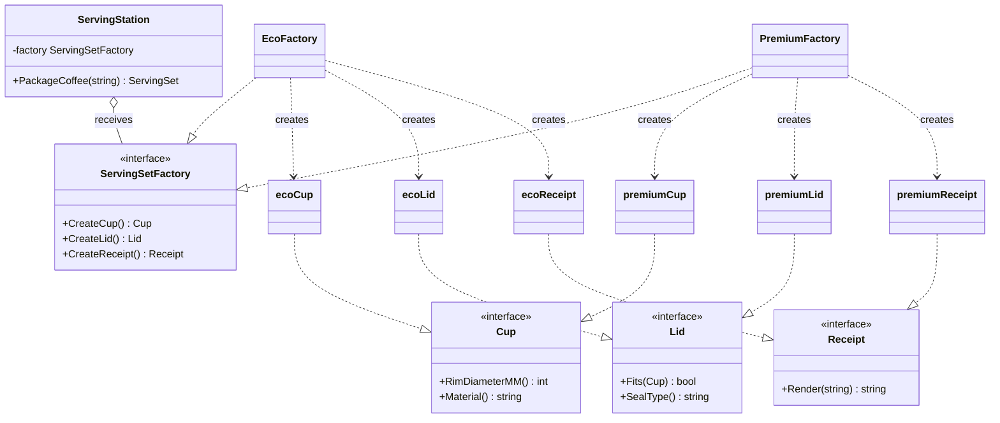

## Factory Method UML

```mermaid
classDiagram
    class Coffee {
        <<interface>>
        +Name() string
        +VolumeML() int
        +Prepare() []PreparationStep
    }

    class Creator {
        <<interface>>
        +Create() Coffee
        +OrderPrepare() PreparedCoffee
    }

    class Espresso
    class Americano
    class Latte

    class EspressoCreator
    class AmericanoCreator
    class LatteCreator

    Espresso ..|> Coffee
    Americano ..|> Coffee
    Latte ..|> Coffee

    EspressoCreator ..|> Creator
    AmericanoCreator ..|> Creator
    LatteCreator ..|> Creator

    EspressoCreator ..> Espresso : creates
    AmericanoCreator ..> Americano : creates
    LatteCreator ..> Latte : creates

    Creator ..> Coffee : returns and uses
```

## Abstract Factory UML

```mermaid
classDiagram
    class Cup {
        <<interface>>
        +RimDiameterMM() int
        +Material() string
    }

    class Lid {
        <<interface>>
        +Fits(Cup) bool
        +SealType() string
    }

    class Receipt {
        <<interface>>
        +Render(string) string
    }

    class ServingSetFactory {
        <<interface>>
        +CreateCup() Cup
        +CreateLid() Lid
        +CreateReceipt() Receipt
    }

    class ServingStation {
        -factory ServingSetFactory
        +PackageCoffee(string) ServingSet
    }

    class EcoFactory
    class PremiumFactory

    class ecoCup
    class ecoLid
    class ecoReceipt

    class premiumCup
    class premiumLid
    class premiumReceipt

    EcoFactory ..|> ServingSetFactory
    PremiumFactory ..|> ServingSetFactory

    ecoCup ..|> Cup
    ecoLid ..|> Lid
    ecoReceipt ..|> Receipt

    premiumCup ..|> Cup
    premiumLid ..|> Lid
    premiumReceipt ..|> Receipt

    ServingStation o-- ServingSetFactory : receives

    EcoFactory ..> ecoCup : creates
    EcoFactory ..> ecoLid : creates
    EcoFactory ..> ecoReceipt : creates

    PremiumFactory ..> premiumCup : creates
    PremiumFactory ..> premiumLid : creates
    PremiumFactory ..> premiumReceipt : creates
```